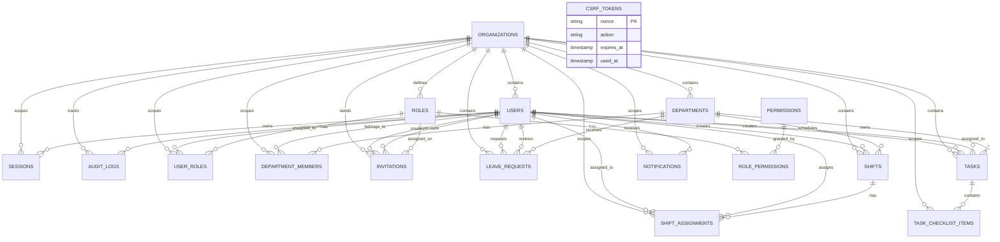

# WorkHub Admin Platform

Enterprise workforce and operations management platform built with Next.js, React, PostgreSQL, Drizzle ORM and Expo.

WorkHub Admin Platform is a modular full-stack SaaS application designed for organizations, municipalities, and enterprise teams to manage:
- departments
- employees
- tasks
- work shifts
- leave requests
- approvals
- internal operations
- user invitations
- roles and permissions
- reports and analytics
- user profiles
- audit logs

The platform is built as a production-oriented modular monolith architecture and is designed to scale into a real enterprise product after the capstone implementation phase.


APP:
https://workhubx.netlify.app/

https://workhubx-mobile.netlify.app/


Test Credentials

admin@sofia.gov  /  pass: pass123   -- admin
maria.hr@sofia.gov  / pass: pass123  -- department manager
elena.hr@sofia.gov  /  pass: pass123  -- employee


---

# Project Goals

The main goal of the project is to build a modern enterprise workforce management system using modern full-stack technologies.

The project demonstrates:
- modular enterprise architecture
- department-based access control
- role-based authorization
- scalable database design
- Web + Mobile synchronization
- RESTful APIs
- Server Actions
- production-oriented engineering practices
- secure JWT session handling
- admin self-service workflows
- operational analytics
- event-driven notification workflows

---

# Main Features

## Department-Based Organization Structure

The system is organized around departments.

Each department has:
- employees
- managers
- tasks
- shifts
- reports
- leave requests
- calendar events
- task workload visibility

Example departments:
- Human Resources
- IT
- Production
- Maintenance

Department Managers can manage only assigned departments.

---

# Role-Based Access Control (RBAC)

The platform supports flexible roles and permissions.

Main Admin can:
- create departments
- assign department managers
- create custom roles
- configure permissions
- manage organization settings
- manage organization users
- edit user role assignments
- edit user department assignments
- create invitation links
- cancel pending invitations
- review organization leave requests
- view organization analytics

Department Managers can:
- approve leave requests
- organize shifts
- manage department tasks
- manage department projects
- assign employees
- view department analytics
- view department shift calendars
- review department staffing availability

Employees can:
- view assigned tasks
- request leave
- view shifts
- participate in projects
- receive notifications
- update task status
- manage task checklist progress
- update personal profile information
- change account password

---

# Employee Management

Manage:
- employee profiles
- department assignments
- employee roles
- employment status
- employee documents
- phone numbers
- account security
- invitation onboarding

Features:
- department assignment
- role assignment
- profile management
- employee search and filtering
- user detail pages
- user edit pages
- user deletion controls
- self-service profile updates
- password changes
- account deletion with Main Admin safety checks

---

# Organization Registration

Organizations can be created through the public registration flow.

Registration creates:
- organization record
- organization slug
- first Main Admin user
- default roles
- default permission records
- Main Admin role permission assignments
- authenticated session for the created admin

Default roles:
- Main Admin
- Department Manager
- Employee

---

# Invitation Management

Main Admin users can invite employees into the organization.

Invitations support:
- invite link generation
- invite token hashing
- expiration dates
- pending status
- accepted status
- cancelled status
- role assignment
- department assignment
- manager department assignment

Invited users can:
- open an invite link
- accept the invitation
- create their profile
- set a password
- join the organization with the assigned role and departments

---

# Task Management

The platform includes a complete task management module.

Tasks support:
- priorities
- statuses
- due dates
- assignees
- comments
- attachments
- status history
- departments
- descriptions
- internal notes
- checklists
- active task lists
- archived task lists
- task filters
- task search
- task deletion

Task statuses:
- Todo
- In Progress
- Completed
- Canceled

Managers can:
- assign tasks
- monitor progress
- manage workloads
- create department tasks
- edit task details
- manage task checklists
- delete accessible tasks

Employees can:
- view assigned tasks
- update task status
- update task notes
- complete checklist items

Task notifications are triggered by:
- new task assignment
- task updates
- checklist item creation
- checklist item completion changes
- checklist item deletion

---


# Leave Management

Employees can request:
- sick leave
- vacation leave
- unpaid leave
- remote work days
- personal leave
- training leave

Leave requests support:
- pending status
- approved status
- rejected status
- start date
- end date
- reason
- review comment
- reviewer tracking
- review timestamp

Department Managers can:
- approve or reject requests
- review leave history
- monitor department staffing availability
- view pending department approvals
- view reviewed department requests

Main Admin users can:
- view leave requests across the organization
- review pending organization requests
- view recently reviewed organization requests

Leave lists support:
- status filters
- type filters
- department filters
- employee filters
- employee search
- server-side pagination

---

# Shift Management

Department Managers can:
- create shifts
- assign employees
- manage recurring schedules
- approve shift swaps
- monitor understaffed shifts
- edit department shifts
- view department shift archive
- view monthly department calendar

Employees can:
- view schedules
- request swaps
- receive schedule updates
- view assigned shift details
- view past and cancelled shifts

Main Admin users can:
- view shifts across the organization
- create organization shifts
- edit organization shifts
- view organization shift archive

Shifts support:
- title
- department
- start time
- end time
- location
- color
- notes
- assigned employees
- scheduled status
- completed status
- cancelled status

Shift scheduling checks:
- assigned employees must be active members of the shift department
- employees cannot be assigned during pending or approved leave
- employees cannot be assigned to overlapping non-cancelled shifts

---

# Reports and Analytics

The platform includes an analytics module for organization and department reporting.

Reports include:
- organization summary
- department summary
- department comparison
- task reports
- leave reports
- shift reports
- employee counts
- active task counts
- completed task counts
- pending leave counts
- approved leave counts
- upcoming shift counts
- completed shift counts

Task analytics include:
- tasks by status
- tasks by priority
- active tasks by department
- overdue tasks
- tasks due this week

Leave analytics include:
- leave by status
- leave by type
- leave by department
- upcoming approved leave

Shift analytics include:
- shifts by status
- shifts by department
- upcoming shifts
- completed shifts
- cancelled shifts
- shifts without assigned employees
- shifts this week
- shifts this month

Report periods:
- this month
- last 30 days
- this quarter
- this year
- last year
- last 2 years
- last 3 years
- last 5 years
- custom date range

---

# Dashboard

The platform includes role-aware dashboard views.

Employees can see:
- active tasks
- upcoming shifts
- leave request history

Department Managers can see:
- managed departments
- pending leave approvals
- upcoming department shifts
- department task overview
- department schedule calendar

Main Admin users can see:
- organization summary
- pending leave requests across the organization
- recently created tasks
- organization-level workload metrics

---

# Notifications System

The platform supports:
- in-app notifications
- push notifications
- unread notifications
- recent notifications
- notification filters
- mark as read
- mark all as read
- notification action links
- notification deduplication
- notification merging for recent task updates

Notifications are triggered by:
- task assignments
- task updates
- task checklist updates
- leave submissions
- leave approvals
- leave rejections
- shift assignments
- shift updates
- shift cancellations
- manager comments

Notification groups:
- tasks
- leave
- shifts
- roles
- departments


# Architecture

The application uses a client-server architecture.

## Web Application
- Next.js App Router
- React
- Server Actions
- Tailwind CSS

The Web app is the primary administrative platform.

Implemented Web routes include:
- public landing page
- about page
- login page
- organization registration page
- invitation acceptance page
- dashboard
- profile
- notifications
- leave pages
- shift pages
- task pages
- reports page
- admin users pages
- admin roles pages
- admin invitations page

---

## Mobile Application
- React Native
- Expo
- RESTful API integration

The mobile app focuses on essential employee functionality:
- tasks
- shifts
- leave requests
- notifications
- profile

---

# Monorepo Structure

```txt
Workhub/
│
├── workhub-web/
│   ├── src/
│   │   ├── app/
│   │   ├── db/
│   │   ├── modules/
│   │   │   ├── audit/
│   │   │   ├── auth/
│   │   │   ├── dashboard/
│   │   │   ├── leave/
│   │   │   ├── notifications/
│   │   │   ├── organizations/
│   │   │   ├── permissions/
│   │   │   ├── profile/
│   │   │   ├── reports/
│   │   │   ├── shifts/
│   │   │   └── tasks/
│   │   └── proxy.ts
│   ├── drizzle/
│   ├── public/
│   ├── user-prompts/
│   ├── AGENTS.md
│   ├── package.json
│   └── tsconfig.json
│
├── workhub-mobile/
│   ├── src/
│   │   ├── app/
│   │   ├── assets/
│   │   ├── components/
│   │   ├── constants/
│   │   ├── hooks/
│   │   └── global.css
│   ├── scripts/
│   ├── AGENTS.md
│   ├── app.json
│   ├── package.json
│   └── tsconfig.json
│
├── workhub-shared/
│   └── src/
│
├── AGENTS.md
├── package-lock.json
├── README.md
└── package.json
```

---

# Modular Architecture

The system is implemented as a modular monolith.

## Architecture Rules

- business logic lives inside services
- modules are isolated
- UI contains minimal business logic
- APIs remain thin
- modules communicate through services and events
- shared infrastructure lives inside packages

Implemented Web modules:
- auth
- audit
- dashboard
- leave
- notifications
- organizations
- permissions
- profile
- reports
- shifts
- tasks

This architecture allows future extraction into microservices if needed.

---

# Technology Stack

## Frontend
- Next.js
- React
- TypeScript
- Tailwind CSS

## Backend
- Next.js API Routes
- Server Actions
- Drizzle ORM
- PostgreSQL
- JWT sessions
- CSRF protection
- bcrypt password hashing

## Mobile
- Expo
- React Native

## Infrastructure
- Neon PostgreSQL
- Cloudflare R2
- Netlify / Vercel
- GitHub Actions

---

# Authentication & Authorization

The platform uses JWT authentication with secure HTTP-only cookies.

Features:
- registration
- login
- logout
- role-based access control
- department-based authorization
- protected routes
- secure password hashing with bcrypt
- organization registration
- DB-backed sessions
- session revocation
- signed JWT validation
- HTTP-only session cookie
- CSRF tokens for sensitive auth actions
- login rate limiting
- registration rate limiting
- globally unique user emails
- current user loading
- invitation acceptance

Session security:
- JWT tokens are signed with `JWT_SECRET`
- sessions are stored in the database
- revoked sessions are rejected
- expired sessions are rejected
- inactive users are rejected
- cookies use `sameSite: "lax"`
- cookies use `secure: true` in production

Authorization helpers include:
- current user requirement
- permission checks
- role checks
- department access checks
- manager-only department checks

---


## Database Schema Relationships



The schema is fully normalized and optimized for scalability.

---

# Scalability

The system is designed to support:
- 10,000+ employees
- 100,000+ tasks
- large organization datasets

Performance features:
- server-side pagination
- optimized DB queries
- indexes
- lazy loading
- paged leave lists
- paged shift lists
- paged task lists
- paged notification lists
- aggregate SQL reporting
- role-scoped data loading
- department-scoped data loading

---

# Security

Security practices include:
- JWT authentication
- secure cookies
- password hashing
- role validation
- department access checks
- audit logging
- protected APIs
- schema validation
- CSRF validation
- rate limiting
- DB session revocation
- invitation token hashing
- password strength validation
- last Main Admin deletion protection
- server-side authorization in services and actions

---
